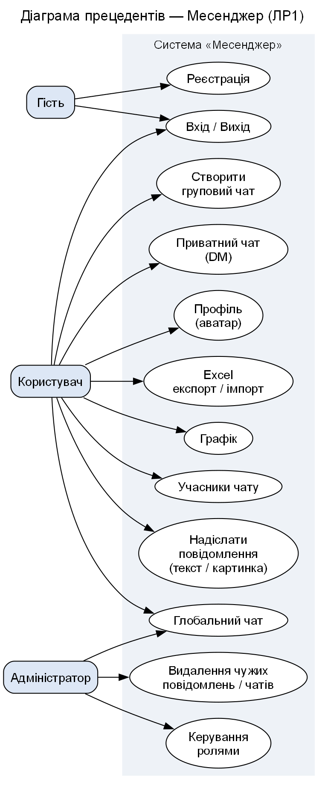
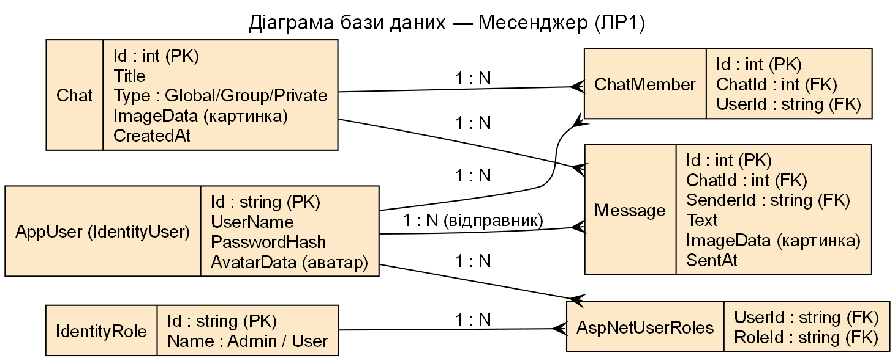

# ІСтаТП · Лабораторна робота 1 — Месенджер (ASP.NET Core MVC)

**Виконавець:** Костащук Ярослав Васильович, група К26

Веб-застосунок «Месенджер»: чати та повідомлення, ролі користувачів.

## Предметна область
Месенджер. Сутності: **AppUser**, **Chat**, **ChatMember**, **Message**.

## Технології (план)
ASP.NET Core MVC · EF Core (Code-First) · PostgreSQL (Npgsql) · ASP.NET Identity.

## Діаграми
### Use-case

### ER

